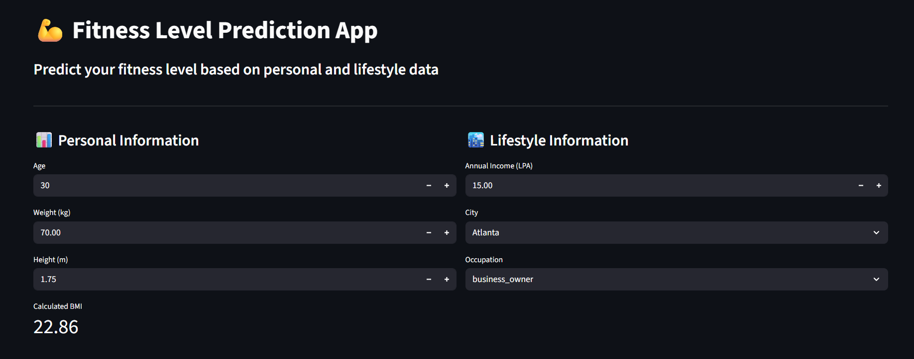
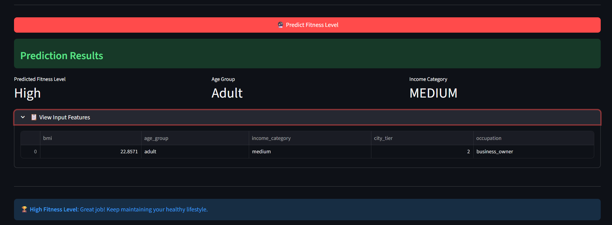

# FitPredict - AI Fitness Level Prediction

Predict fitness levels (High, Medium, Low) using machine learning based on personal and lifestyle data.

## 📸 Screenshots

<div align="center">
  
  
</div>


## ⚡ Quick Start

```bash
# Install dependencies
pip install -r requirements.txt

# Run the app
streamlit run streamlit_app.py
```

Open `http://localhost:8501` in your browser.

## 🎯 Features

- 💪 **Smart Predictions** - Predicts fitness level from age, weight, height, income, city, and occupation
- 📊 **Automatic Feature Engineering** - Calculates BMI and categorizes age groups, income, and city tiers
- 🎨 **Interactive Web Interface** - Clean, user-friendly Streamlit dashboard
- 🤖 **Machine Learning Model** - Random Forest classifier with 80%+ accuracy
- 📈 **Confidence Scores** - See prediction confidence and class probabilities
- ✅ **Input Validation** - Ensures data quality with built-in validation

## 📁 Project Structure

```
├── data/
│   └── fitness_data.csv        # Training dataset (100 samples)
├── screenshots/                # Application screenshots
├── fastapi.ipynb              # Model training & experimentation
├── streamlit_app.py           # Web application
├── model.pkl                  # Trained ML model
├── requirements.txt           # Python dependencies
└── README.md                  # Documentation
```

## 🧠 How It Works

The model analyzes personal and lifestyle data through 5 engineered features:

| Feature | Description | Categories |
|---------|-------------|------------|
| **BMI** | Body Mass Index | Calculated from weight/height |
| **Age Group** | Age category | Teen, Young Adult, Adult, Senior |
| **Income Category** | Income bracket | Low (<₹10L), Medium (₹10-30L), High (≥₹30L) |
| **City Tier** | City classification | Tier 1 (major metros), Tier 2 (secondary cities) |
| **Occupation** | Job category | Student, Engineer, Teacher, etc. |

### Model Details

- **Algorithm**: Random Forest Classifier (100 estimators)
- **Preprocessing**: OneHotEncoder for categorical variables
- **Pipeline**: Integrated preprocessing and prediction
- **Training Split**: 80/20 train-test split
- **Target Classes**: High, Medium, Low fitness levels

## 🚀 Installation & Setup

### Prerequisites
- Python 3.8 or higher
- pip package manager

### Step-by-Step Setup

1. **Clone the repository**
   ```bash
   git clone https://github.com/ayeshowcode/ashok-fitness.git
   cd ashok-fitness
   ```

2. **Create virtual environment** (recommended)
   ```bash
   python -m venv .venv
   
   # Windows
   .venv\Scripts\activate
   
   # macOS/Linux
   source .venv/bin/activate
   ```

3. **Install dependencies**
   ```bash
   pip install -r requirements.txt
   ```

4. **Run the application**
   ```bash
   streamlit run streamlit_app.py
   ```

## 💻 Usage

### Web Interface

1. Open the app at `http://localhost:8501`
2. Enter your details:
   - Personal info (age, weight, height)
   - Income level (in LPA)
   - Select city from dropdown
   - Choose occupation
3. Click "Predict Fitness Level"
4. View results with confidence scores and recommendations

### Training Your Own Model

Open and run the Jupyter notebook:

```bash
jupyter notebook fastapi.ipynb
```

The notebook walks through:
- Loading and exploring the dataset
- Feature engineering and preprocessing
- Training the Random Forest model
- Evaluating model performance
- Saving the model to `model.pkl`

## 🛠️ Tech Stack

- **Machine Learning**: scikit-learn, pandas, numpy
- **Web Framework**: Streamlit
- **Data Processing**: pandas, OneHotEncoder, ColumnTransformer
- **Model Persistence**: pickle
- **Development**: Jupyter Notebook

## 📊 Dataset

The model is trained on a curated fitness dataset with:
- **100 samples** across diverse demographics
- **7 input features**: age, weight, height, income, city, occupation, smoker
- **16 US cities** (Tier 1: NYC, LA, Chicago, etc.; Tier 2: Denver, Atlanta, etc.)
- **Target variable**: Fitness Level (High, Medium, Low)

## 🔮 Future Enhancements

- [ ] Add more training data for improved accuracy
- [ ] Implement hyperparameter tuning
- [ ] Add data visualization dashboard
- [ ] Deploy to cloud platform (Streamlit Cloud, Heroku)
- [ ] Create REST API with FastAPI
- [ ] Add user authentication and history tracking
- [ ] Include exercise recommendations based on fitness level

## 🤝 Contributing

Contributions are welcome! Feel free to:
1. Fork the repository
2. Create a feature branch (`git checkout -b feature/AmazingFeature`)
3. Commit your changes (`git commit -m 'Add AmazingFeature'`)
4. Push to the branch (`git push origin feature/AmazingFeature`)
5. Open a Pull Request

## 📄 License

This project is licensed under the MIT License.

## 👤 Author

**Ayesh** - [@ayeshowcode](https://github.com/ayeshowcode)

---

⭐ **If you found this project helpful, please consider giving it a star!**
